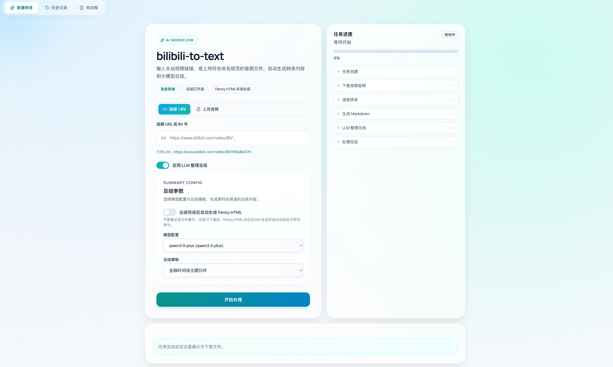
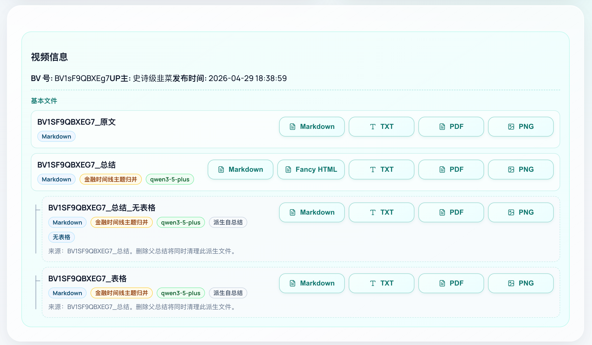
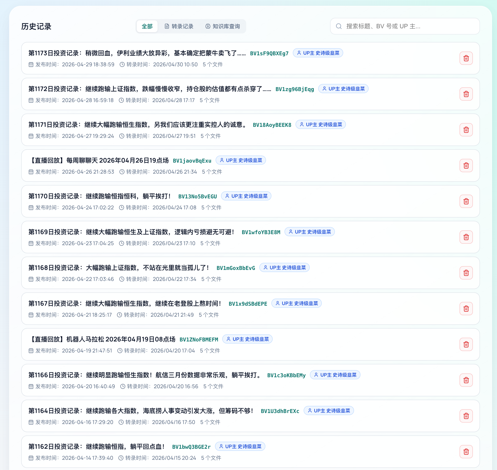
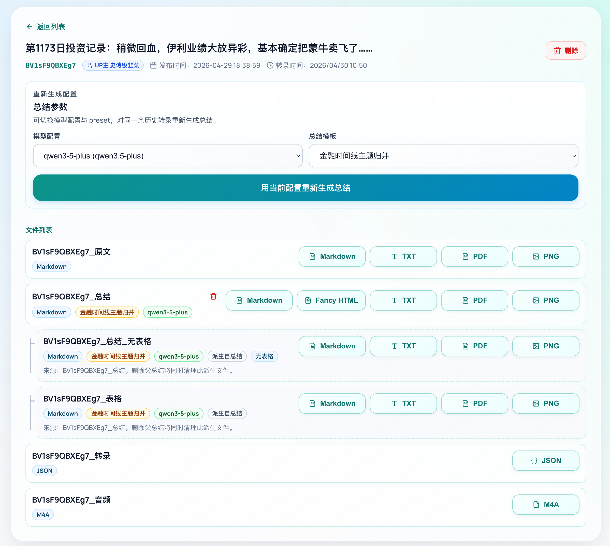
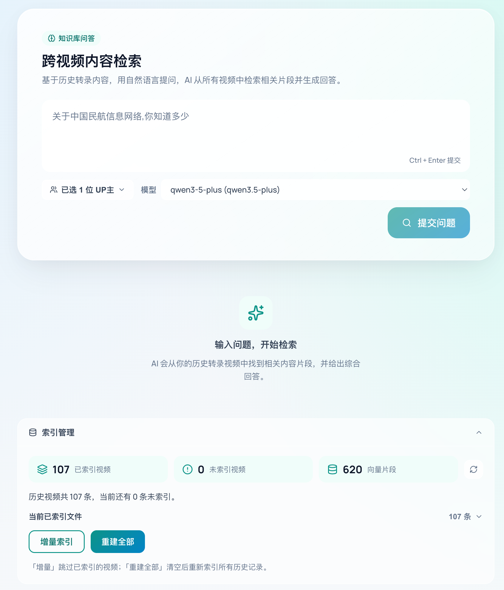
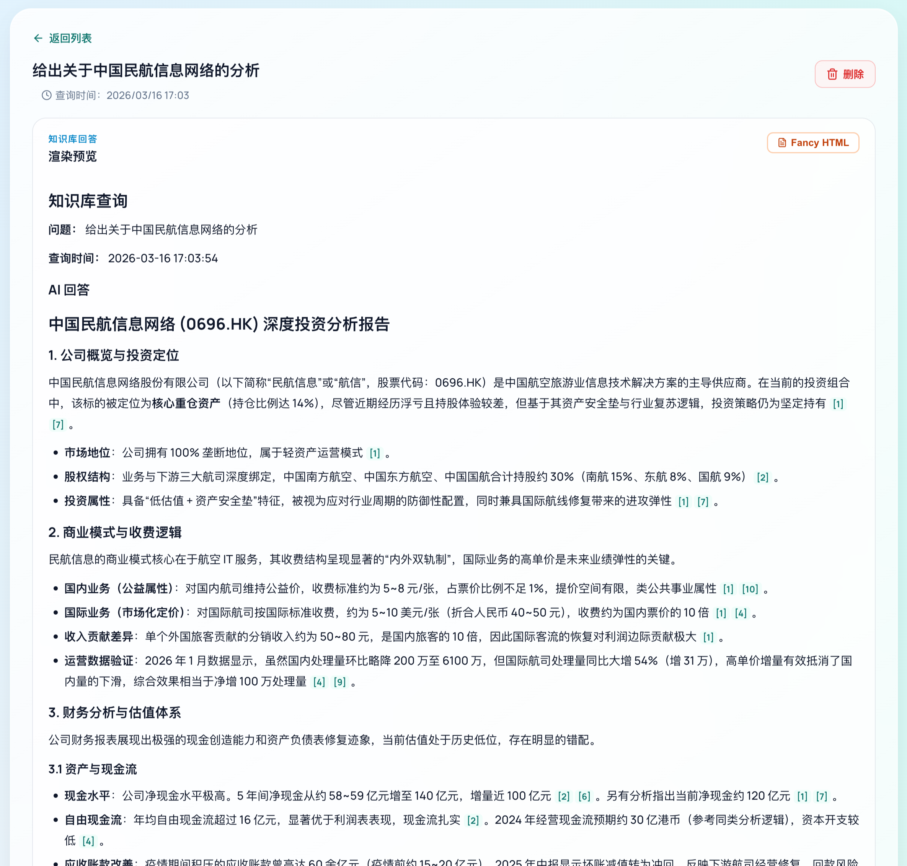
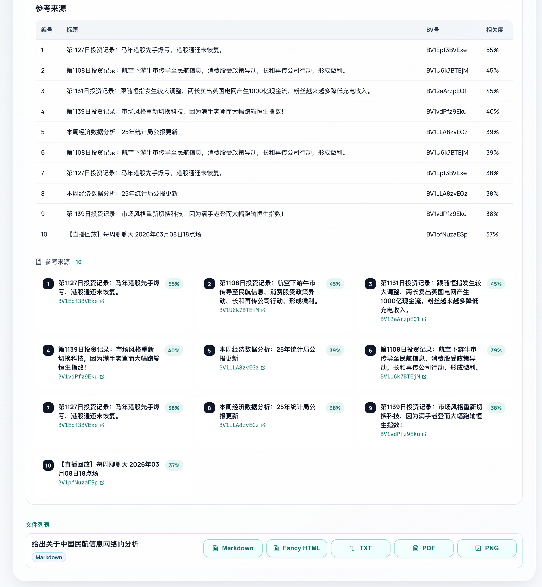
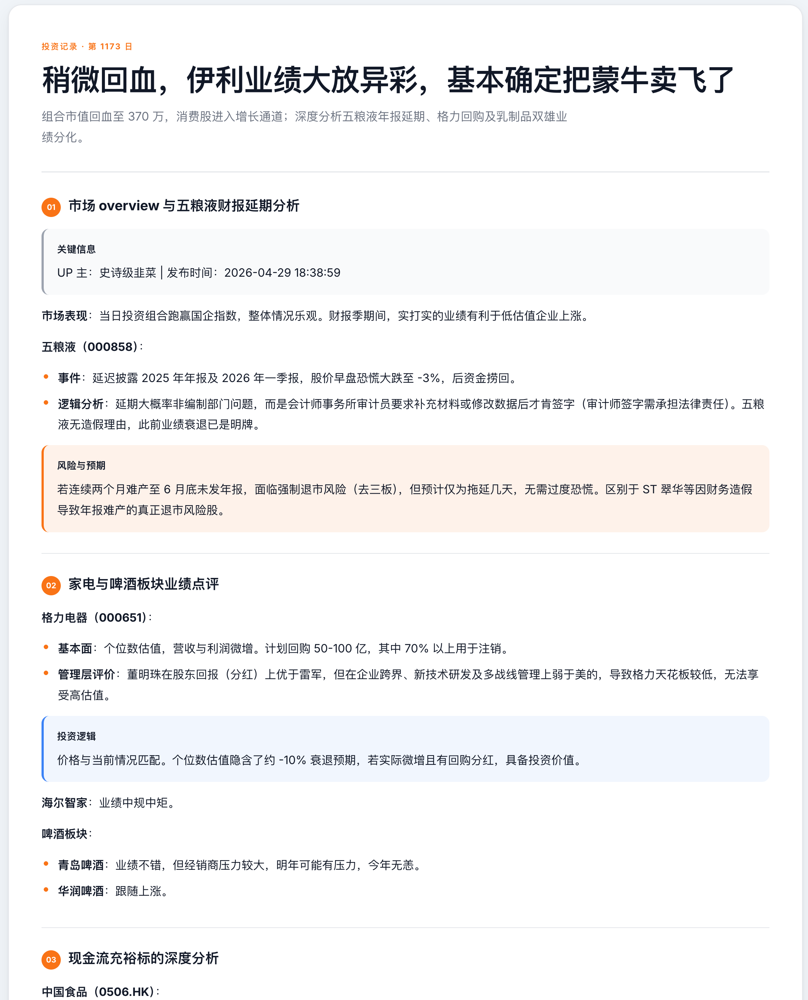

# bilibili-to-text

Bilibili 视频转文字工具：自动下载音频、语音转录、生成 Markdown/TXT，并通过 LLM 生成结构化总结，并导出为 PDF/PNG/HTML。


- 提供 CLI 和 Web UI 两种使用方式
- 提供 Open Public 模式，用户使用自己的 API KEY 进行调用
- 提供监控功能，自动监控指定 B 站 UP 主视频更新并自动转录，完成之后通过飞书机器人通知用户

## 功能

- 使用 [yutto](https://github.com/yutto-dev/yutto) 下载 Bilibili 视频音频
- 语音转文字（支持多 provider）：
  - [Groq](https://console.groq.com/) Whisper 兼容接口
  - 阿里云 DashScope / Qwen ASR
- 转录结果导出为 Markdown / TXT
- 使用 LiteLLM 兼容接口对接任意 LLM 生成总结
- 三种产物存储后端：本地磁盘 / MinIO / 阿里云 OSS
- Web UI（FastAPI 后端 + Vue/Vite 前端）管理历史转录
- 可选 RAG：检索历史转录内容并问答
- Markdown 派生转换：PDF / PNG / HTML

> [!NOTE]
> - 注意只有 Web UI + RAG + Open Public + Monitor + 飞书通知 几种功能在 Linux/MacOS 上经过测试
> - Docker/Cli 未经测试


## 效果预览

<details>
<summary>转录页面</summary>



</details>

<details>
<summary>转录完成后的文件下载</summary>



</details>

<details>
<summary>历史记录页面</summary>



</details>

<details>
<summary>历史详情页面</summary>



</details>

<details>
<summary>跨视频知识检索页面</summary>



</details>

<details>
<summary>跨视频知识检索页面效果 1</summary>



</details>

<details>
<summary>跨视频知识检索页面效果 2</summary>



</details>

<details>
<summary>生成的 Fancy HTML</summary>



</details>

## 目录结构

```text
.
├── b2t/                  # 核心 Python 包与 CLI pipeline
├── web-ui/
│   ├── backend/          # FastAPI 后端
│   └── frontend/         # Vue + Vite 前端
├── tests/                # Pytest 测试
├── scripts/              # 辅助脚本
├── config.toml.example   # 配置模板
├── summary_presets.toml  # LLM 总结 Prompt 预设
└── docker/               # Nginx 前端静态服务配置
```

## 环境要求

| 依赖 | 说明 |
|------|------|
| Python 3.12+ | 运行核心包 |
| [uv](https://docs.astral.sh/uv/) | Python 包管理 |
| [Bun](https://bun.sh/) | 前端包管理与开发服务器 |
| `ffmpeg` | 音频处理 |
| `pandoc` | Markdown 转换（可选） |
| Playwright Chromium | PDF/PNG 渲染（可选） |

macOS 使用 Homebrew 安装系统依赖：

```bash
brew install ffmpeg pandoc
```

Linux (Debian/Ubuntu) 使用 apt 安装系统依赖：

```bash
sudo apt install ffmpeg pandoc
```

安装 Playwright Chromium（导出 PDF/PNG 需要）：

```bash
playwright install chromium
```

## 快速开始

### 1. 克隆仓库并安装依赖

```bash
git clone https://github.com/<owner>/bilibili-to-text.git
cd bilibili-to-text
uv sync
```

安装前端依赖：

```bash
cd web-ui/frontend && bun install && cd ../..
```

### 2. 配置

复制配置模板：

```bash
cp config.toml.example config.toml
```

**最简配置**（阿里云 OSS 存储 + Qwen ASR + 百炼 LLM）：

```toml
[storage]
backend = "alicloud"

[storage.alicloud]
region = "cn-beijing"
bucket = "your-oss-bucket"
access_key_id = "your-access-key-id"
access_key_secret = "your-access-key-secret"
base_prefix = "b2t"
temporary_prefix = "temp-audio"

[stt]
profile = "qwen-main"

[stt.profiles.qwen-main]
provider = "qwen"
language = "zh"
storage_profile = "alicloud"
qwen_api_key = "your-dashscope-api-key"
qwen_model = "qwen3-asr-flash-filetrans"

[summarize]
profile = "bailian-main"

[summarize.profiles.bailian-main]
provider = "bailian"
model = "qwen3-max"
api_base = "https://dashscope.aliyuncs.com/compatible-mode/v1"
api_key = "your-dashscope-api-key"
```

> **提示**：DashScope API Key 可在 [阿里云百炼控制台](https://bailian.console.aliyun.com/) 获取；OSS Bucket 需提前创建并确保 Access Key 有读写权限。

完整配置项参考 `config.toml.example`。

### 3. 启动 Web UI

参见下方[启动 Web UI](#启动-web-ui) 章节。

## CLI 使用

处理单个视频：

```bash
uv run b2t "https://www.bilibili.com/video/BVxxxxxxxxxx"
```

常用选项：

```bash
uv run b2t "https://www.bilibili.com/video/BVxxxxxxxxxx" \
  --config config.toml \
  --output ./transcriptions \
  --summary-preset timeline_merge \
  --summary-profile groq-main
```

跳过 LLM 总结：

```bash
uv run b2t "https://www.bilibili.com/video/BVxxxxxxxxxx" --no-summary
```

交互式模式：

```bash
uv run b2t
```

## 启动 Web UI

在两个终端中分别启动后端和前端：

```bash
# 终端 1：后端（默认端口 8000）
uv run uvicorn backend.main:app --app-dir web-ui --host 0.0.0.0 --port 8000 --reload
```

```bash
# 终端 2：前端（默认端口 6010）
cd web-ui/frontend && bun run dev
```

指定非默认后端端口：

```bash
B2T_BACKEND_PORT=8001 bun run dev
```

## 宿主机后端 + Nginx 容器部署

后端运行在宿主机上：

```bash
uv run uvicorn backend.main:app --app-dir web-ui --host 0.0.0.0 --port 8000
```

另开一个终端，构建前端并用官方 Nginx 容器托管静态文件：

```bash
./scripts/serve_frontend_nginx.sh up
```

浏览器访问 `http://127.0.0.1:6010`。Nginx 容器只托管 `web-ui/frontend/dist` 并把 `/api/*` 代理到宿主机后端。

如果端口不是默认值：

```bash
B2T_FRONTEND_PORT=6011 B2T_BACKEND_PORT=8001 ./scripts/serve_frontend_nginx.sh up
```

open-public 模式：

```bash
# 终端 1：后端
B2T_WEB_UI_MODE=open-public uv run uvicorn backend.main:app --app-dir web-ui --host 0.0.0.0 --port 8000
```

```bash
# 终端 2：前端 Nginx 容器
./scripts/serve_frontend_nginx.sh up
```

停止前端容器：

```bash
./scripts/serve_frontend_nginx.sh down
```

## open-public 模式

用于对外公开演示。该模式禁用音频上传、历史删除和本地 API Key，要求用户在页面中自行填写 DashScope API Key：

```bash
# 终端 1：后端
B2T_WEB_UI_MODE=open-public uv run uvicorn backend.main:app --app-dir web-ui --host 0.0.0.0 --port 8000 --reload
```

```bash
# 终端 2：前端
cd web-ui/frontend && bun run dev
```

如果使用 Nginx 容器托管构建后的前端，则改用：

```bash
./scripts/serve_frontend_nginx.sh up
```

> **注意**：open-public 模式依赖 Qwen ASR 的临时 URL 流程，`config.toml` 中仍需配置可用的 MinIO 或阿里云 OSS。

## 测试

```bash
uv run pytest
```

## License

MIT

## Star History

<a href="https://www.star-history.com/?repos=KKKZOZ%2Fbilibili2text&type=date&legend=top-left">
 <picture>
   <source media="(prefers-color-scheme: dark)" srcset="https://api.star-history.com/chart?repos=KKKZOZ/bilibili2text&type=date&theme=dark&legend=top-left" />
   <source media="(prefers-color-scheme: light)" srcset="https://api.star-history.com/chart?repos=KKKZOZ/bilibili2text&type=date&legend=top-left" />
   
 </picture>
</a>